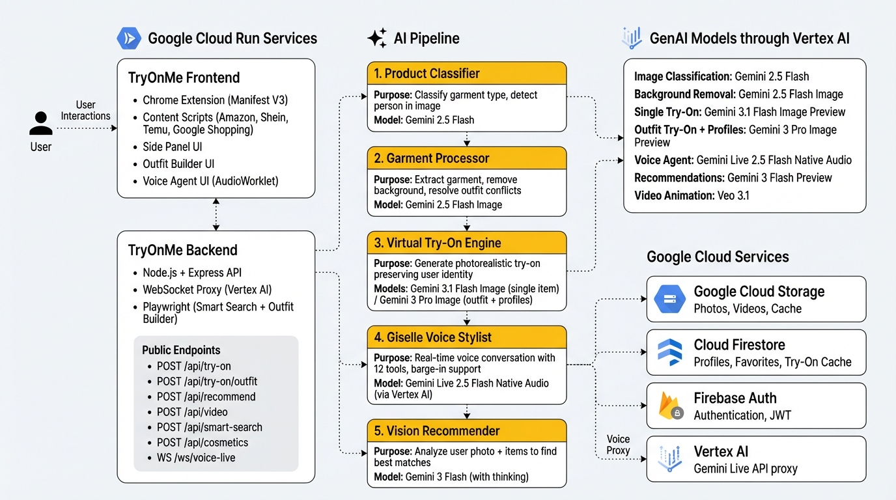

# Gemini TryOnMe Everything

**AI-Powered Universal Virtual Try-On with Live Voice Stylist**

A Chrome Extension that lets you see clothes on YOUR body before you buy. Browse any product page on Amazon, SHEIN, or Temu, click "Try It On", and see the garment on your own body in seconds. Talk to **Giselle**, your AI voice stylist, to get personalized outfit recommendations in real-time — she sees your screen, analyzes your body type, and helps you build the perfect look.

> Built for the [**Gemini Live Agent Challenge**](https://geminiliveagentchallenge.devpost.com/) — **Live Agents** category
>
> Powered by **Gemini Live API**, **Gemini 3 Pro Image**, **Gemini 2.5 Flash**, and hosted on **Google Cloud Run**

---

## Features

### 1. Giselle — Live Voice AI Stylist (Gemini Live API)
Talk to Giselle, your personal AI fashion stylist, using natural voice conversation. She can see your screen, analyze your body type and skin tone, and help you find the perfect outfit.
- **Real-time voice conversation** via Gemini Live API (`gemini-live-2.5-flash-native-audio`)
- **Barge-in support** — interrupt Giselle mid-sentence naturally (server-side VAD + client-side energy-threshold echo gating)
- **12 voice-activated tools** — search products, build outfits, try on items, save favorites, animate videos, get AI recommendations — all hands-free
- **Vision-based recommendations** — Giselle calls an AI vision model that analyzes your photo + all items on screen to recommend the best combination
- **Distinct persona** — warm, fashion-forward stylist with the Aoede voice, context-aware responses
- **WebSocket proxy architecture** — browser connects to backend via WebSocket, backend proxies to Gemini Live API via Vertex AI with server-side authentication

### 2. Product Page Try-On
Browse any product page on Amazon, SHEIN, or Temu. A **"Try It On"** button appears on the product image. Click it and see the garment on your body in seconds.
- Auto-detects product type (tops, bottoms, dresses, footwear, cosmetics)
- Smart outfit conflict resolution (e.g., trying a top on someone wearing a dress)
- Auto-refresh on color/variation swatch changes
- Save to favorites, share via email, and animate results into video
- Full body and half body framing options
- 3 selectable AI-generated poses

### 3. AI Smart Search
Type what you want in natural language: *"black dresses for women"*. Playwright browses Amazon in a headless browser, applies quality filters (4+ stars), and returns 20+ curated products — each with a "Try On" button.
- Natural language queries instead of keyword search
- Playwright-based product discovery (headless browser on Cloud Run)
- Product grid with prices, ratings, and direct links
- Instant try-on from search results

### 4. Outfit Builder
Build a complete outfit across **6 categories**: top, bottom, shoes, necklace, earrings, and bracelet. AI searches for each category in parallel, presents a virtual wardrobe with hangers and accessory bar, and lets you mix & match. Try the full outfit together in one shot.
- 6 parallel Playwright product searches
- Background removal on clothing/shoe images
- Visual wardrobe with hanger display + accessory ceiling bar
- Single-call multi-garment try-on with identity preservation (Gemini 3 Pro Image)
- AI vision-based recommendations across all 6 categories

### 5. Video Animation
Transform any try-on result into a 6-second video with natural model-like movement, fabric flow, and subtle poses.
- Powered by **Google Veo 3.1** (image-to-video generation)
- 720p portrait format (9:16)
- Save to cloud or download locally

### 6. Cosmetics Try-On
Virtual makeup application using AI inpainting. Try lipstick, eyeshadow, blush, foundation, eyeliner, and mascara in any color on your own face.

### 7. Cross-Retailer Price Comparison
Compare Amazon prices with Walmart, SHEIN, Temu, Poshmark, and more. One Google Shopping search per product finds alternatives across retailers automatically.
- No `site:` filter — finds more cross-retailer results
- Deduplication by title
- Retailer extracted from card text + URL domain

### 8. Try-On Cache
Identical try-ons are cached for 48 hours using Firestore + Cloud Storage — saving AI generation costs and returning instant results on repeated try-ons.

### 9. Sharing & Email
Share your try-on results via download, clipboard copy, or email. Send branded emails with the try-on image embedded inline to yourself or anyone.

### 10. Favorites & Profiles
Full user account system with cloud storage. Save your best looks, browse your try-on history, and manage multiple AI-generated profile poses.

---

## Architecture



```
┌─────────────────────┐     ┌─────────────────────┐     ┌──────────────────────┐
│   Chrome Extension   │     │   Express Backend    │     │    AI Models          │
│   (Manifest V3)      │────>│   (Cloud Run)        │────>│                      │
│                      │     │                      │     │  Gemini Live API     │
│  • Content Script    │     │  /api/try-on         │     │  Gemini 3.1 Flash    │
│  • Background Worker │     │  /api/try-on/outfit  │     │  Gemini 3 Pro Image  │
│  • Popup Side Panel  │     │  /api/analyze        │     │  Gemini 2.5 Flash    │
│  • Smart Search UI   │     │  /api/cosmetics      │     │  Gemini 3 Flash      │
│  • Outfit Builder UI │     │  /api/video          │     │  Google Veo 3.1      │
│  • Voice Agent UI    │     │  /api/recommend      │     │                      │
│                      │     │  /api/smart-search   │     └──────────────────────┘
└─────────┬───────────┘     │  /api/auth/*         │
          │                  │  /api/profile        │
          │  WebSocket       │  /api/favorites      │
          └─────────────────>│  /ws/voice-live ─────────> Gemini Live API
                             │  (Vertex AI proxy)   │     (bidirectional audio)
                             └─────────────────────┘
                                      │
                      ┌───────────────┼──────────────┐
                      │               │              │
                      v               v              v
               ┌──────────┐   ┌──────────┐   ┌──────────┐
               │ Firebase  │   │  Cloud   │   │Firestore │
               │ Auth/JWT  │   │ Storage  │   │ Profiles │
               │           │   │  Photos  │   │ Favorites│
               └──────────┘   │  Videos  │   └──────────┘
                               └──────────┘
```

### Smart Try-On Pipeline (5 Steps)

Each single-garment try-on goes through a 5-step AI orchestration:

| Step | Name | Model | What It Does |
|------|------|-------|--------------|
| 1 | Product Analysis | Gemini 2.5 Flash | Classifies garment type, color, category |
| 2 | Garment Preprocessing | Gemini 2.5 Flash Image | Detects model in image, extracts clean garment |
| 3 | Outfit Classification | Gemini 2.5 Flash | Classifies what the user is currently wearing |
| 4 | Conflict Resolution | buildSmartPrompt | Builds context-aware prompt based on garment + outfit combination |
| 5 | Virtual Try-On | Gemini 3.1 Flash Image | Generates photorealistic result preserving user identity |

### Outfit Builder Pipeline

The outfit builder uses a single Gemini 3 Pro Image call with all garments + face reference photos for identity preservation:

1. User selects items across 6 categories (top, bottom, shoes, necklace, earrings, bracelet) from the wardrobe
2. All garment images go through preprocessing (person detection + extraction)
3. Face reference photos are fetched from Cloud Storage as identity anchors
4. Single API call to Gemini 3 Pro with garments first, identity photos last, low temperature (0.4)

---

## Technology Stack

### AI Models

| Model | Provider | Role |
|-------|----------|------|
| **Gemini Live 2.5 Flash Native Audio** | Google (Vertex AI) | Real-time voice conversation with Giselle AI stylist |
| **Gemini 3.1 Flash Image Preview** | Google | Single-garment try-on, accessory try-on, garment extraction |
| **Gemini 2.5 Flash Image** | Google | Background removal, inpainting, cosmetics visualization |
| **Gemini 2.5 Flash** | Google | Product classification, outfit detection, person detection |
| **Gemini 3 Pro Image** | Google | Multi-garment outfit try-on, AI profile pose generation (better identity preservation) |
| **Gemini 3 Flash** | Google | Vision-based outfit recommendations (with thinking mode) |
| **Veo 3.1** | Google | Image-to-video animation of try-on results |

### Google Cloud Infrastructure

| Service | Usage |
|---------|-------|
| **Google Cloud Run** | Backend hosting (Node.js + Express), auto-scaling, WebSocket support |
| **Vertex AI** | Gemini Live API access with server-side authentication (service account) |
| **Firebase Auth** | User authentication, email verification, JWT tokens |
| **Google Cloud Storage** | User photos, AI-generated poses, try-on results, videos |
| **Cloud Firestore** | User profiles, favorites, video metadata, try-on cache (48h TTL) |
| **Gmail SMTP** | Email sharing of try-on results (via Nodemailer) |

### Application Stack

| Component | Technology |
|-----------|-----------|
| Frontend | Chrome Extension (Manifest V3) — content scripts, background service worker, popup |
| Backend | Node.js + Express on Google Cloud Run |
| Product Discovery | Playwright (Python) — headless browser for Smart Search + Outfit Builder |
| Image Processing | Sharp |
| Video Generation | Google Veo 3.1 |
| Auth | Firebase Auth with JWT token verification |

---

## Prerequisites

- **Node.js 18+**
- **Google Chrome** browser
- **Google Cloud** account with:
  - Firebase project with Auth enabled
  - Cloud Storage bucket
  - Firestore database
  - Service account credentials
- **Google Gemini API key** (from Google AI Studio)
- **Gmail account** with App Password (for email sharing)

---

## Installation & Setup

### 1. Clone the Repository

```bash
git clone https://github.com/your-username/GeminiTryOnMe.git
cd GeminiTryOnMe
```

### 2. Install Backend Dependencies

```bash
cd backend
npm install
```

### 3. Configure Environment Variables

Create `backend/.env` with the following:

```env
# GCP Configuration
GOOGLE_APPLICATION_CREDENTIALS=/path/to/your-service-account.json
GCP_PROJECT_ID=your-project-id
GCS_BUCKET_NAME=your-storage-bucket

# Firebase Auth
FIREBASE_API_KEY=your_firebase_api_key

# AI Model Keys
GEMINI_API_KEY=your_gemini_api_key

# Email Sharing (Gmail SMTP)
GMAIL_USER=your-gmail@gmail.com
GMAIL_APP_PASSWORD=your-app-password

# Server
PORT=3001
TRYON_PROVIDER=gemini
```

### 4. Start the Backend Server

```bash
# Development (with auto-reload)
npm run dev

# Production
npm start
```

The server will start on `http://localhost:3001`. Verify with:
```bash
curl http://localhost:3001/
# Should return: {"status":"ok","service":"Gemini TryOnMe Everything Backend",...}
```

### 5. Load the Chrome Extension

1. Open Chrome and navigate to `chrome://extensions`
2. Enable **Developer mode** (toggle in the top-right corner)
3. Click **Load unpacked**
4. Select the `extension/` directory from this project
5. Pin the extension icon in the Chrome toolbar

### 6. First-Time Setup (User Account)

1. Click the Gemini TryOnMe extension icon in the toolbar
2. **Create an account** — sign up with email and verify via the code sent to your inbox
3. **Upload 5 photos** — 3 full-body photos + 2 face close-ups
4. **Wait for AI profile generation** — Gemini generates 3 professional model poses of you (~30s)
5. You're ready! Navigate to any product page on Amazon, SHEIN, or Temu to start trying on

---

## How to Use

### Product Page Try-On

1. Go to any clothing/shoes/cosmetics product page on Amazon, SHEIN, or Temu
2. A sparkle **"Try It On"** button appears on the product image
3. Click it — the button toggles to **"Try On: ON"** and the overlay opens
4. Wait ~10-15s for the AI pipeline to generate your try-on result
5. Click different color swatches — try-on auto-refreshes
6. Click the result image to enlarge it in a lightbox
7. Use the side panel to switch between **Pose A/B/C** and **Full/Half body**
8. Click **Save to Favorites** to keep the look
9. Share via **Download**, **Copy**, or **Email**
10. Click **Animate** to generate a video of you wearing the outfit

### AI Smart Search

1. Click the extension icon → **Smart Search** tab
2. Type a natural language query (e.g., *"red summer dress for women"*)
3. An AI agent browses products and returns curated results
4. Click **Try On** on any result to see it on your body

### Outfit Builder

1. Click the extension icon → **Outfit Builder** tab
2. Describe your desired **top, bottom, shoes, necklace, earrings, and bracelet**
3. Click **Build Outfit** — Playwright searches for each of the 6 categories in parallel
4. A virtual wardrobe appears with hangers, shoe rack, and accessory ceiling bar
5. Select one item from each category (or ask Giselle to recommend)
6. Click **Try On** to see the complete outfit on your body
7. Click **Save to Favorites** to keep the outfit

---

## API Endpoints

| Method | Endpoint | Description |
|--------|----------|-------------|
| POST | `/api/analyze` | Analyze product image (Gemini classification) |
| POST | `/api/try-on` | Single-garment virtual try-on (5-step pipeline) |
| POST | `/api/try-on/outfit` | Multi-garment outfit try-on (single Gemini call) |
| POST | `/api/cosmetics` | Cosmetics try-on via inpainting |
| POST | `/api/video` | Start video generation (Veo 3.1) |
| GET | `/api/video/:jobId` | Poll video generation status |
| POST | `/api/video/save` | Save generated video to Cloud Storage |
| POST | `/api/image/remove-bg` | Background removal (Gemini) |
| POST | `/api/smart-search` | AI-powered product search |
| POST | `/api/share/email` | Email sharing of try-on results |
| POST | `/api/recommend` | Vision-based AI outfit recommendations |
| WS | `/ws/voice-live` | Gemini Live API WebSocket proxy (voice agent) |
| POST | `/api/auth/signup` | User registration |
| POST | `/api/auth/login` | User login |
| POST | `/api/auth/confirm` | Email verification |
| POST | `/api/auth/refresh` | Token refresh |
| GET | `/api/profile` | Get user profile |
| PUT | `/api/profile` | Update user profile |
| POST | `/api/profile/photos` | Upload user photo |
| GET | `/api/profile/photos/all` | Get all user photos |
| GET | `/api/favorites` | Get saved favorites |
| POST | `/api/favorites` | Save a favorite |
| DELETE | `/api/favorites/:productId` | Remove a favorite |

---

## Project Structure

```
GeminiTryOnMe/
├── backend/
│   ├── server.js              # Express app entry point
│   ├── package.json           # Node.js dependencies
│   ├── .env                   # Environment variables (not committed)
│   ├── routes/
│   │   ├── tryOn.js           # Try-on endpoints (single + outfit)
│   │   ├── analyze.js         # Product analysis endpoint
│   │   ├── cosmetics.js       # Cosmetics try-on endpoint
│   │   ├── video.js           # Video generation endpoints
│   │   ├── auth.js            # Authentication endpoints
│   │   ├── profile.js         # User profile management
│   │   ├── favorites.js       # Favorites CRUD
│   │   ├── smartSearch.js     # AI Smart Search endpoint
│   │   ├── share.js           # Email sharing endpoint
│   │   ├── recommend.js      # Vision-based AI recommendations
│   │   └── voiceLive.js      # Gemini Live API WebSocket proxy
│   ├── services/
│   │   ├── gemini.js          # Gemini API (try-on, extraction, profiles)
│   │   ├── imageProcessor.js  # Image processing (BG removal, inpainting)
│   │   ├── classifier.js      # Product classification (Gemini)
│   │   ├── veo.js             # Veo 3.1 video generation (Google)
│   │   ├── giselleLive.js     # Voice agent config (system prompt, tools)
│   │   ├── giselle.js         # Voice chat (Gemini)
│   │   ├── firestore.js       # Firestore operations
│   │   ├── storage.js         # Cloud Storage operations
│   │   ├── firebaseAuth.js    # Firebase Auth operations
│   │   ├── tryOnCache.js      # Try-on result caching (Firestore + GCS)
│   │   ├── circuitBreaker.js  # Circuit breaker pattern
│   │   └── withTimeout.js     # Promise timeout utility
│   ├── middleware/
│   │   ├── auth.js            # JWT verification middleware
│   │   ├── cors.js            # CORS configuration
│   │   └── validation.js      # Input validation
│   └── python-services/
│       ├── smart_search.py    # Product search agent
│       └── add_to_cart.py     # Cart automation
├── extension/
│   ├── manifest.json          # Chrome Extension manifest (MV3)
│   ├── background.js          # Service worker (auth, message routing)
│   ├── content.js             # Content script (product page integration)
│   ├── popup/
│   │   ├── popup.html         # Side panel UI
│   │   ├── popup.js           # Side panel logic
│   │   └── popup.css          # Side panel styles
│   ├── smart-search/
│   │   ├── results.html       # Smart Search results page
│   │   ├── results.js         # Smart Search logic
│   │   └── results.css        # Smart Search styles
│   ├── outfit-builder/
│   │   ├── wardrobe.html      # Outfit Builder wardrobe UI
│   │   ├── wardrobe.js        # Outfit Builder logic
│   │   └── wardrobe.css       # Outfit Builder styles
│   ├── styles/
│   │   └── content.css        # Content script overlay styles
│   ├── utils/
│   │   ├── api-client.js      # API client (message passing)
│   │   ├── scraper-registry.js # Site detection + config
│   │   ├── amazon-scraper.js  # Amazon page scraping
│   │   ├── shein-scraper.js   # SHEIN page scraping
│   │   ├── temu-scraper.js    # Temu page scraping
│   │   └── image-utils.js     # Image loading and conversion
│   └── icons/                 # Extension icons
├── scripts/                   # Setup and utility scripts
└── README.md                  # This file
```

---

## Cloud Deployment

### Automated Deploy to Google Cloud Run

A one-command deploy script is provided:

```bash
./deploy.sh
```

This script:
1. Validates required environment variables and GCP authentication
2. Builds and deploys the backend to Google Cloud Run using `gcloud run deploy`
3. Configures memory (4Gi), CPU (2), timeout (600s), and auto-scaling (0-4 instances)
4. Outputs the deployed service URL

**Prerequisites for deployment:**
- `gcloud` CLI installed and authenticated (`gcloud auth login`)
- Docker or Cloud Build enabled on the GCP project
- Service account with `roles/aiplatform.user` IAM role (for Vertex AI / Gemini Live API)

### Manual Deploy

```bash
cd backend
gcloud run deploy geminitryonme-backend \
  --source . \
  --region us-central1 \
  --project YOUR_PROJECT_ID \
  --allow-unauthenticated \
  --timeout=600 \
  --memory=4Gi \
  --cpu=2 \
  --min-instances=0 \
  --max-instances=4
```

---

## Testing

### Run Unit Tests

```bash
cd backend && npm test
```

Tests cover: outfit builder (6-category search, concurrency limiter, 7-image try-on), circuit breaker state machine, input validation, and voice agent (12 tools, system prompt, config).

### Verify Backend is Running
```bash
curl http://localhost:3001/
```

### End-to-End Test
1. Start the backend: `cd backend && npm run dev`
2. Load the extension in Chrome
3. Sign up / sign in through the extension popup
4. Upload your 5 photos (3 body + 2 face)
5. Navigate to a clothing product page on Amazon, SHEIN, or Temu
6. Click "Try It On" and verify the result appears
7. Try switching color swatches — should auto-refresh
8. Click the result image to test the lightbox
9. Test share buttons (Download, Copy, Email)
10. Click "Animate" to test video generation
11. Open the Outfit Builder and build a complete outfit

---

## License

MIT
